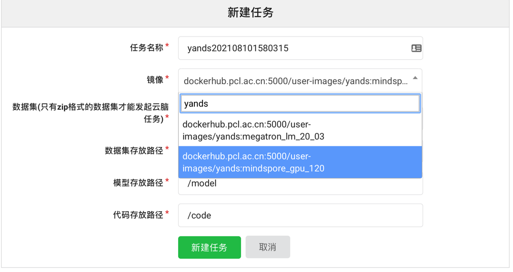
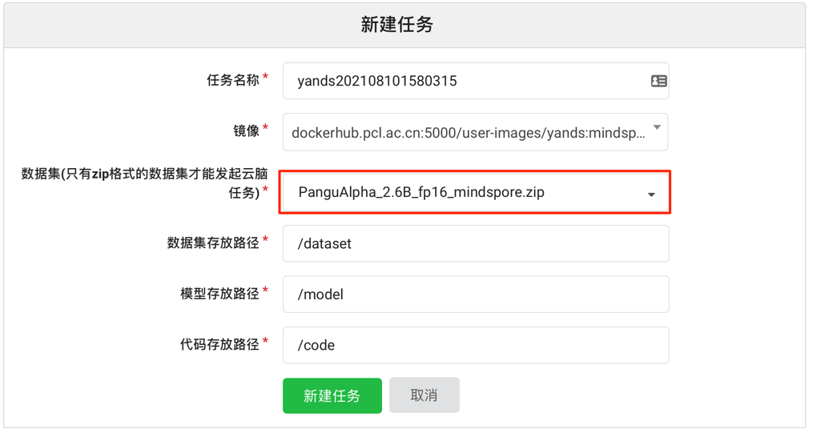

# 3分钟实现盘古α模型推理
《目前启智社区的服务器内存有限（只有16g），所以暂时推理不了。不过后续会开放内存更大的服务器，敬请关注！！》


启智社区中项目下的云脑页面可以申请一张 T4 GPU，没有服务器的个人或学生可以在启智社区上快速免费体验盘古α。本教程将手把手教你3分钟实现盘古α的推理流程。

# 1、注册启智社区账号
这一步就不细说了，无非就是邮箱、账号、密码。 用申请的账号登录到启智社区。

# 2、派生 PanGu-Alpha-GPU 项目
如果你想申请启智社区的 GPU 就必须先有项目，然后在项目里面申请 T4。所以需要把 [PanGu-Alpha-GPU](https://git.openi.org.cn/PCL-Platform.Intelligence/PanGu-Alpha-GPU) 
派生成为你个人的项目。

进入[PanGu-Alpha-GPU](https://git.openi.org.cn/PCL-Platform.Intelligence/PanGu-Alpha-GPU) 项目，点击右上角的`派生`按钮，在原项目基础上派生出自己的项目。

# 3、申请GPU

- 点击项目中的`云脑`


- 点击`新建任务`

- 在`镜像`那一栏里面搜索下图的镜像



- 在`数据集存放路径`那一栏选 'PanguAlpha_2.6B_fp16_mindspore.zip'



- 点击`新建任务`

- 等待一段时间就会出现 `调试` 按钮，点击进去就是熟悉的 jupyter 调试界面了

# 4、推理
- 目录结构

    /dataset/               存放数据集的地方，刚刚提交任务的时候我们把模型放在该目录下
  
    /code/                  存放代码的地方，你项目中的代码会拷贝到该目录下

    /model/                 存放模型的地方，在任务提交界面可以通过`模型下载`下载该目录下的文件

- 进入 /code/inference_mindspore_gpu 目录
  
- 运行推理脚本

```bash
python run_inference.py --model=2B6_fp16 --load_ckpt_path=/dataset/PanguAlpha_2.6B_fp16.ckpt
```

恭喜你，完成了推理流程